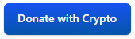

[](https://commerce.coinbase.com/checkout/faf64f90-2e80-46ee-aeba-0fde14cbeb46)
[](https://www.paypal.com/donate?hosted_button_id=GTSXAJQEBZ7XG)

# bootstrap-sign-in-web-component
**Bootstrap Sign In Web Component** is a very simple but effective jQuery plugin for creating a sign-in form. It fully support Bootstrap v4.


## Download
Help us find bugs, add new features or simply just feel free to use it. Download **Bootstrap Sign In Web Componentr** from our [ GitHub](https://github.com/canchito-dev/bootstrap-sign-in-web-component) site.


## License
The MIT License (MIT)  

Copyright (c) 2018, canchito-dev  

Permission is hereby granted, free of charge, to any person obtaining a copy of this software and associated documentation files (the “Software”), to deal in the Software without restriction, including without limitation the rights to use, copy, modify, merge, publish, distribute, sublicense, and/or sell copies of the Software, and to permit persons to whom the Software is furnished to do so, subject to the following conditions:  

The above copyright notice and this permission notice shall be included in all copies or substantial portions of the Software.  

THE SOFTWARE IS PROVIDED “AS IS”, WITHOUT WARRANTY OF ANY KIND, EXPRESS OR IMPLIED, INCLUDING BUT NOT LIMITED TO THE WARRANTIES OF MERCHANTABILITY, FITNESS FOR A PARTICULAR PURPOSE AND NONINFRINGEMENT. IN NO EVENT SHALL THE AUTHORS OR COPYRIGHT HOLDERS BE LIABLE FOR ANY CLAIM, DAMAGES OR OTHER LIABILITY, WHETHER IN AN ACTION OF CONTRACT, TORT OR OTHERWISE, ARISING FROM, OUT OF OR IN CONNECTION WITH THE SOFTWARE OR THE USE OR OTHER DEALINGS IN THE SOFTWARE.

## Contribute Code
If you would like to become an active contributor to this project please follow theses simple steps:

1.  Fork it
2.  Create your feature branch
3.  Commit your changes
4.  Push to the branch
5.  Create new Pull Request


## User Guide
The plug-in can be used with `div` elements. There are two ways to initialize the plugin: (1) via attributes; (2) via JavaScript.

In addition, you will neet a template file, typically an html file, with the form template.

The main purpose of the plug-in, is to automatically add features to the form, such as validations or password toggle button.

### Via Data Attributes
```html
<div id="bootsignin" data-toogle="bootsignin"></div>
```

### Via JavaScript
Add the container html element.

```html
<div id="bootsignin""></div>
```

Afterwards, init the plut-in.
```javascript
$('#bootsignin').bootsignin();
```

### Options
Options can be passed via data attributes or JavaScript.

<table>
	<thead>
		<tr>
			<th>Name</th>
			<th>Attribute</th>
			<th>type</th>
			<th>default</th>
			<th>description</th>
		</tr>
	</thead>
	<tbody>
		<tr>
			<td>-</td>
			<td>data-toggle</td>
			<td>String</td>
			<td>bootsignin</td>
			<td>Enables the plug-in without writing JavaScript</td>
		</tr>
		<tr>
			<td>showPasswordToggler</td>
			<td>data-show-password-toggler</td>
			<td>Boolean</td>
			<td>false</td>
			<td>Enables the show password toggler button. Disabled by default</td>
		</tr>
		<tr>
			<td>passwordToggler</td>
			<td>-</td>
			<td>Object</td>
			<td>
			{	<br>
				append: 'append' - Appends the show/hide icon. Possible values are 'right' or 'left'	<br>
            	iconPrefix: 'fas' - Base eye icon class	<br>
            	iconShow: 'fa-eye' - Open eye icon	<br>
            	iconHide: 'fa-eye-slash' - Close eye icon	<br>
            	tooltip: 'Show/Hide password' - The tooltip of show/hide icon	<br>
            }
            </td>
			<td>Defines the password toggler button and its properties</td>
		</tr>
		<tr>
			<td>ajax</td>
			<td>-</td>
			<td>Boolean</td>
			<td>true</td>
			<td>Defines whether should be submitter via an asynchronous HTTP (Ajax) request. Enabled by default</td>
		</tr>
		<tr>
			<td>ajaxSettings</td>
			<td>-</td>
			<td>Object</td>
			<td></td>
			<td>Ajax request settings that shall be used for server-side communication. For the full list of settings go to http://api.jquery.com/jQuery.ajax/</td>
		</tr>
		<tr>
			<td>template</td>
			<td>data-template</td>
			<td>String</td>
			<td>template.html</td>
			<td>The location of the template. Complete path</td>
		</tr>
		<tr>
			<td>validateForm</td>
			<td>data-validate-form</td>
			<td>Boolean</td>
			<td>false</td>
			<td>Enables the form validation. Disabled by default</td>
		</tr>
		<tr>
			<td>formErrorMessages</td>
			<td>-</td>
			<td>Object</td>
			<td>
			{	<br>
	        	email: 'Empty or incorrect email',	<br>
	        	password: 'Empty or incorrect password'	<br>
	        }
			</td>
			<td>Error messages to be shown if there are errors during the form submittion</td>
		</tr>
		<tr>
			<td>prepareFormData</td>
			<td>-</td>
			<td>function</td>
			<td>
				@param $form - the form as jQuery object<br>
				@return the modified data as a serialized object
			</td>
			<td>Function called before submitting the form. Can be used for doing additional things to the form data</td>
		</tr>
	</tbody>
</table>

By default, the icons used are from [Font Awesome](http://fontawesome.io/).
